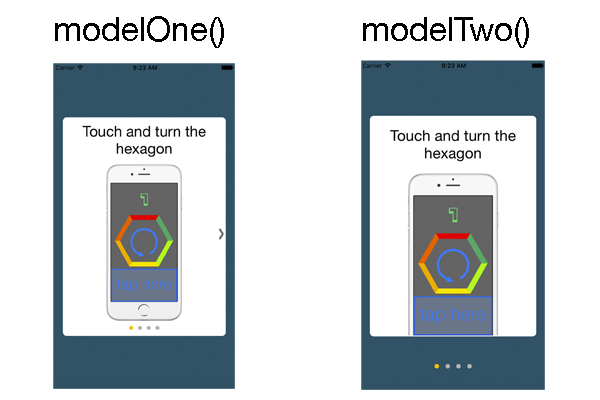

# BasicTutorialView
this is a simple template to create views for tutorials

Template:

Files:

    1. BasicTutorialView for Swift2: the files for use this template. you must move these files within your project.

    2. Example for ios9: This is a example project.

How to do?

    1. Create a variable of type windowView():
            let window = windowView()

    2. Import images and create a array of images:
            let imagesArray = [String]()
            imagesArray = ["img1","img2","img3","img4"]

    3. Create a array of titles:
            let titlesArray = [String]()
            titlesArray = ["title of image 1","title of image 2","title of image 3","title of image 4"]

    4. instantiate object:
            window.modelTwo(self, arrayImages: self.imagesArray, arrayTitles: self.titlesArray)

