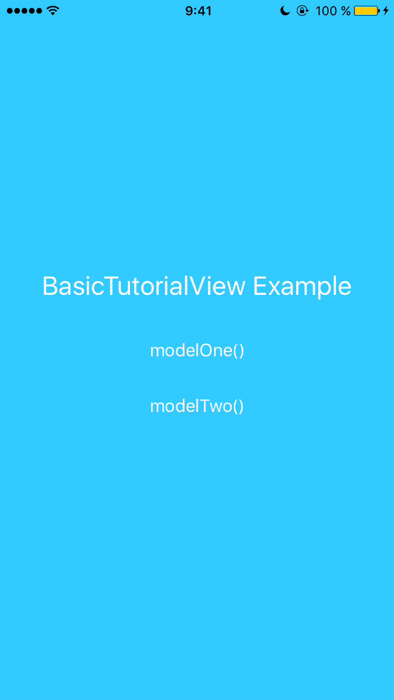

# BasicTutorialView

This is a template to create an initial tutorial for your application. It allows you to create very quickly and without difficulty.

Lenguage: Swift 2 & Swift 3

Author: Alan Roldan


## Example modelOne:




Example modelTwo:


## Files:

    1. Example_BasicTutorialView: 
        This is a example project.

    2. BasicTutorialView for Swift2: 
        The files for use this template. you must move these files within your project.


## How to use?

    1. Create a variable of type windowView():
``` swift
let window = windowView() ```

    2. Import images and create a array of images:
``` swift
let imagesArray = [String]()
imagesArray = ["img1","img2","img3","img4"]
```

    3. Create a array of titles:
```swift
let titlesArray = [String]()
titlesArray = ["title of image 1","title of image 2","title of image 3","title of image 4"]
```

    4. instantiate object:
```swift
window.modelTwo(self, arrayImages: self.imagesArray, arrayTitles: self.titlesArray)
```


 Images should be square size only. (example: 512x512/1024x1024 etc..)


